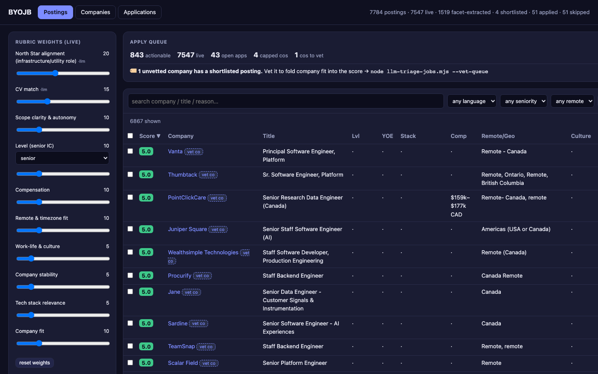
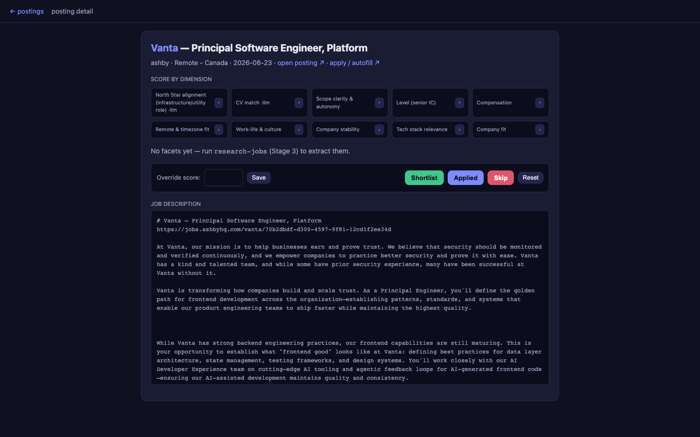
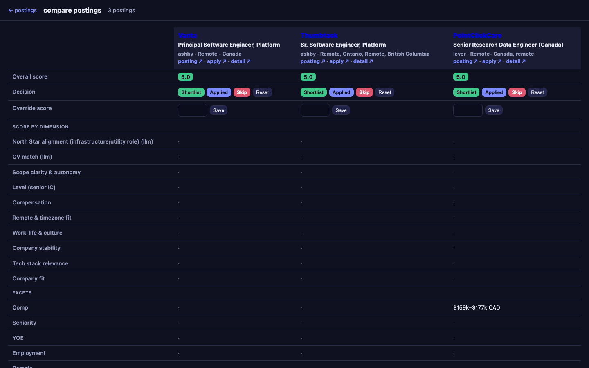
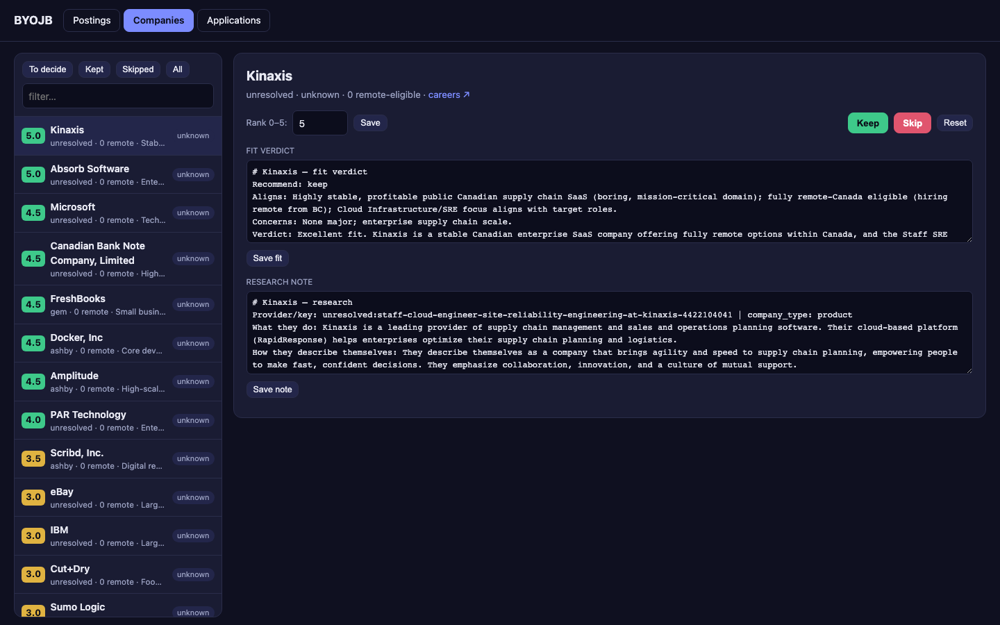
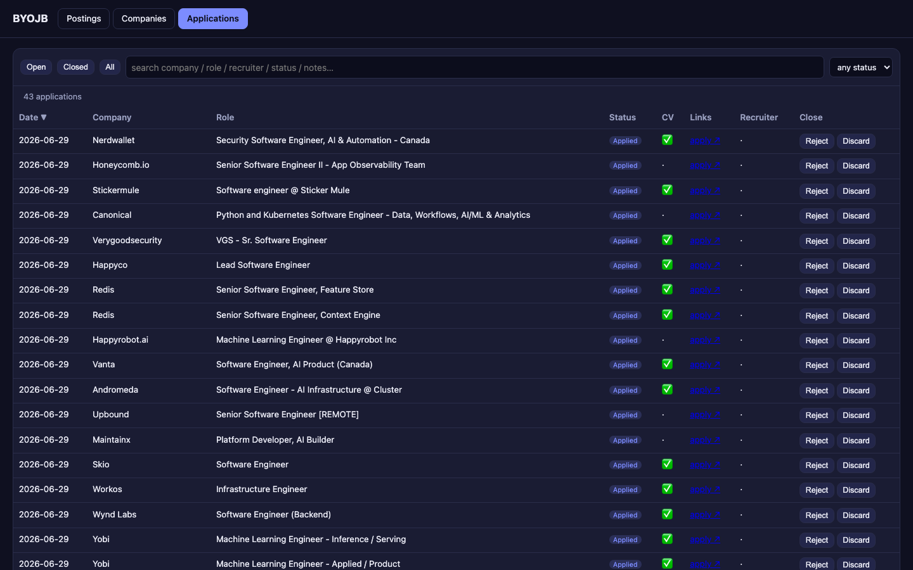

# Build Your Own Job Board (BYOJB)

**Build Your Own Job Board (BYOJB)** is a self-hosted, personal web job board and automated application tracker. It combines background scraping, automated AI-assisted ranking and triage, an interactive local dashboard, and a Chrome Extension to help you run a high-quality, targeted job search.

Originally derived from `career-ops`, BYOJB transitions the tool from a CLI-centric application to a rich web dashboard layout with background pipeline automation.

---

## Daily Flow

1. **Scan target portals for new postings:**
   In your terminal, run the zero-token scanner:
   ```bash
   npm run scan
   ```
   Or inside Gemini CLI / Claude Code, run:
   ```bash
   /byojb-scan
   ```

2. **Run AI Vetting & Facet Extraction:**
   Run the triage and research pipelines using your agent subscription to process the queue of unprocessed postings and companies. In Gemini CLI or Claude Code:
   * `/byojb-triage-jobs` (Triage: processes the queue of raw postings with fast ranking using world knowledge)
   * `/byojb-research-jobs` (Research: reads the queue of triaged JDs for full facet extraction)
   * `/byojb-triage-companies` / `/byojb-research-companies` (for company vetting and dossier building queues)

3. **Manage and Track in the Web Dashboard:**
   Start the local web dashboard:
   ```bash
   npm run dashboard
   ```
   Open `http://localhost:4173` in your browser. Review rankings, adjust rubric sliders, shortlist postings, keep/skip companies, and view application statuses.

4. **Autofill forms and record applications:**
   Load the `extension/` directory into Chrome (Developer Mode -> Load unpacked). The extension autofills ATS application fields based on `config/profile.yml` and automatically reports submissions back to your dashboard.

---

## Setup & Onboarding

### 1. Requirements
* **Node.js** v18 or later
* **Playwright** (for liveness verification and page crawling)
* **Python 3** (Optional: only needed if using JobSpy broad-board scraping)

### 2. Install
Clone the repository, install npm packages, and download Playwright dependencies:
```bash
npm install
npx playwright install chromium
```

If using JobSpy for broad job board pull (LinkedIn, Indeed, etc.):
```bash
python3 -m venv .venv
./.venv/bin/pip install -r ingest/requirements.txt # or install jobspy & pyyaml
```

### 3. Personal Config
Create local configuration files from the templates:
```bash
cp config/profile.example.yml config/profile.yml
cp config/jobspy.example.yml config/jobspy.yml
cp config/company_criteria.example.yml config/company_criteria.yml
cp config/company_fit.example.yml config/company_fit.yml
cp config/rubric.example.yml config/rubric.yml
cp templates/portals.example.yml portals.yml
```

Edit these files with your details:
* `config/profile.yml`: Set your name, target roles, location, timezone, and application profile.
* `config/rubric.yml`: Configure weights for criteria (tech stack, remote timezone, compensation, work-life balance, stability).
* `portals.yml`: Customize target companies and ATS careers pages.

Verify readiness anytime:
```bash
npm run doctor
```

---

## Architecture & Workflows

### 1. Company Discovery & Research Pipeline (Target Vetting)
```
  [ Discovery: /byojb-find-companies ]   → Search & import target companies (YC, Sequoia, etc.)
                   ↓
  [ Triage: /byojb-triage-companies ]     → Quick LLM vetting based on criteria & fit
                   ↓
  [ Research: /byojb-research-companies ] → Scraping careers & about pages to compile dossiers
                   ↓
  [ portals.yml Configuration ]          → List of verified company portals fed to scanner
```

### 2. Job Posting & Tracking Pipeline
```
  [ Scan: /byojb-scan or npm run scan ]  → Pulls raw listings from lever/greenhouse/ashby/etc. in portals.yml
            ↓
  [ Queue (unprocessed postings) ]       → Stores raw listings awaiting triage
            ↓
  [ Triage: /byojb-triage-jobs ]         → Quick world-knowledge fit filtering (1-5) via LLM
            ↓
  [ Queue (triaged postings) ]           → Stores shortlisted listings awaiting research
            ↓
  [ Research: /byojb-research-jobs ]     → Reads full JDs, extracts structured JSON facets (no scoring)
            ↓
  [ Dashboard: npm run dashboard ]       → Interactive UI: sliders re-weight & score, keep/skip
            ↓
  [ Chrome Extension ]                   → DOM autofill & records applications back to the dashboard
```

* **Company Discovery & Vetting:** Search for target corporations matching filters using `/byojb-find-companies` (or `node find-companies.mjs`), filter out mismatches with `/byojb-triage-companies` (or `node llm-triage.mjs`), and generate detailed dossiers with `/byojb-research-companies` (or `node llm-triage.mjs --research`). Verified portals are automatically added to `portals.yml`.
* **Job Scanners:** Hits public ATS APIs (Greenhouse, Lever, Ashby, BambooHR, Workday, etc.) or uses local parsers via `/byojb-scan` or `npm run scan` (which runs `node scan.mjs`). Zero LLM token costs.
* **AI Job Triage & Research:** Runs sequentially on your own agent subscription (Gemini Antigravity or Claude Code) using custom slash commands `/byojb-triage-jobs` (or `node llm-triage-jobs.mjs`) and `/byojb-research-jobs` (or `node llm-triage-jobs.mjs --research`) to filter and extract objective facets (languages, remote constraints, salary, tech stack) from the queues.
* **Re-weightable Scores:** The dashboard scores each role dynamically on a facet-weighted model. Start the dashboard with `npm run dashboard` (running `node web/server.mjs`) to adjust rubric sliders and instantly re-sort the queue without re-running the LLM.
* **Tracking & Autofill:** Track applications, sync status records, and use the MV3 Chrome Extension to autofill forms from your profile and record submissions back to the DB.

## Dashboard Showcase

The local web dashboard integrates live weights adjustment, company vetting details, comparison metrics, and application pipelines:

<p align="center">
  
  <br />
  <sub><b>Postings Queue View:</b> Dynamic slider controls to adjust rubric weights live, filter postings, and review scored openings.</sub>
</p>

<br />

<table width="100%">
  <tr>
    <td width="50%" valign="top" align="center">
      <h4>Posting Detail View</h4>
      
      <br />
      <sub>Review full job descriptions, AI analysis, and fit verdicts.</sub>
    </td>
    <td width="50%" valign="top" align="center">
      <h4>Comparison View</h4>
      
      <br />
      <sub>Compare selected jobs side-by-side on custom dimensions.</sub>
    </td>
  </tr>
  <tr>
    <td width="50%" valign="top" align="center">
      <h4>Companies Console</h4>
      
      <br />
      <sub>Vet company fit and review scraped employer dossiers.</sub>
    </td>
    <td width="50%" valign="top" align="center">
      <h4>Applications Tracker</h4>
      
      <br />
      <sub>Manage applied jobs, update recruiting stages, and store interview notes.</sub>
    </td>
  </tr>
</table>

---

## Contributing

Contributions are welcome! Since BYOJB is designed to be paired with agentic AI coders (like Gemini Antigravity or Claude Code), here are some great ways to use AI assistants to contribute to this repository:

1. **Broadening Scraper Coverage:** Expand the crawler capabilities in `scan.mjs` to target new platforms.
2. **Adding Vetted Companies & Portals:** Share company careers page URLs and scraped company dossiers (under `data/company-research/`) to grow the default tracked target list in `templates/portals.example.yml`.
3. **Specializing for Non-Engineering Roles:** Currently, BYOJB is optimized for software engineering searches. Propose prompt updates under the `modes/` folder or rubric overrides in `rubric.yml` to specialize matching for product, design, marketing, or other job types.
4. **Adding Custom ATS Parsers:** Use LLMs to generate new parser configurations under the `providers/` directory or write bespoke company parsers for local scraping.
5. **Improving UI/UX of the Web Dashboard:** Ask Claude or Gemini to propose premium styling changes, micro-animations, or layout optimizations inside the `web/` folder.
6. **Enhancing Autofill Heuristics:** Suggest LLM prompts to analyze form inputs and refine field classification rules inside `autofill-fields.mjs`.

Feel free to open a Pull Request or file an issue to report bugs and suggest improvements!

---

## License & Attribution

BYOJB is released under the **MIT License**.

This project is originally based on [career-ops](https://github.com/santifer/career-ops) (MIT License) by **Santiago Fernández de Valderrama**. We would like to express our gratitude to the original author for the excellent foundation, parsing architecture, and pre-configured ATS portals config.
